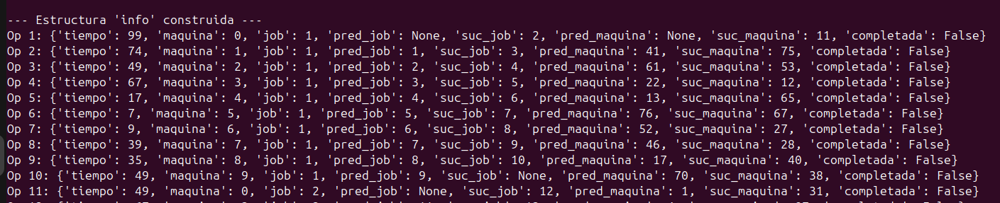

# Job_Shop

El código en este proyecto sirve para la resolución de problemas de tipo *Job-Shop*. Se recibe un ejemplar (debe estar dentro de la carpeta `src`), se genera una solución aleatoria inicial, se evalúa su makespan, se genera su vecindad 1-flip, mediante ---heurística pendiente--- se itera hasta ---criterio de paro--- para encontrar una mejor solución.

**Nota:** El `Makefile` está dentro de la carpeta `src`.

Con
```
make generar_sol_aleatoria_y_makespan
```
podemos probar el generador de soluciones aleatorias y la calculadora del makespan.

Es importante notar que:


Los índices de las máquinas están contados a partir del $0$, así que si una operación está programada en la máquina $m$, a nivel implementación quedará en la máquina $m-1$.

Esto es así porque a la hora de leer el ejemplar: 
```python
id = 1  # Empezamos a contar desde 1 para las operaciones
        for i in range(1, numero_de_trabajos + 1):
            linea_actual = lineas[i].split()
            numeros = [int(x) for x in linea_actual]

            # Creamos índices para iterar la lista de números
            maquina = 0
            tiempo = 1
            for _ in range(int(len(numeros) / 2)):
                vertice = Vertice(id, i, numeros[maquina], numeros[tiempo])
                lista_de_vertices.append(vertice)
                maquina += 2
                tiempo += 2
                id += 1
```
Explícitamente pedimos que los jobs se contaran a partir de $1$, pero con las máquinas no hicimos eso.
