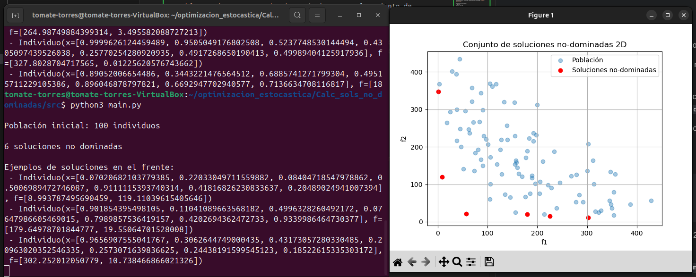

# NSGA-II

**Flujo detallado del algoritmo**
1. Inicialización

Se genera aleatoriamente una población $P_0$​ de tamaño $N$, evaluando cada individuo en los $M$ objetivos.

2. Ordenamiento no dominado

    * *Fast Non-Dominated Sort:* clasifica $P_t$​ en frentes $F_1,F_2,…$ según niveles de dominancia.

    * Asigna a cada individuo un rango igual al índice de su frente.
    * Más abajo se explica esto con más detalle.

3. Cálculo de la distancia de hacinamiento (crowding distance)

    Para cada frente $F_i$:

    * Ordena soluciones por cada objetivo.

    * Calcula la distancia de hacinamiento como la suma de las distancias normalizadas a los vecinos inmediatos en cada objetivo
 

4. Selección por torneo binario

    Para generar la población de hijos $Q_t$​:

    * Repite $N$ veces un torneo entre dos individuos aleatorios.

    * Compara primero eel rango; si hay empate elige el de mayor distancia de hacinamiento. 

5. Cruce y mutación

    Aplica operadores como SBX (Simulated Binary Crossover) y mutación polinomial a los padres seleccionados para crear $Q_t$

6. Selección de supervivencia

    Une las poblaciones $R_t=P_t \cup Q_t​$

    Repite el ordenamiento no dominado y el cálculo de distancia en $R_t$​.

    Llena $P_{t+1}$​ con frentes completos hasta alcanzar $N$ individuos.

    Si un frente no cabe entero, ordena sus soluciones por distancia de hacinamiento y selecciona las más dispersas para completar $P_{t+1}$


7. Criterio de parada

    Nos detenemos después de un número $G$ de generaciones o un límite de evaluaciones.

Fuente de esto: Artículo original del 2002 sobre NSGA-II, https://medium.com/%40rossleecooloh/optimization-algorithm-nsga-ii-and-python-package-deap-fca0be6b2ffc, ChatGPT y esta cosa: https://www.sciencedirect.com/topics/computer-science/non-dominated-sorting-genetic-algorithm-ii?utm_source=chatgpt.com 

## Sobre la representación de los individuos de la población y la generadora de individuos no-dominados.

Definimos un tipo de objeto llamado `Individuo`, esto porque cada punto que le pasamos al algoritmo de soluciones no dominadas tiene en principio dos atributos importantes asociados:

1. Sus coordenadas en el **espacio de búsqueda** 
2. Sus coordenadas en el **espacio objetivo**

Y es más sencillo acceder a estos usando objetos; esto está en `individuo.py`

`comparacion_objetivos.py` tiene la funcionalidad de reducir el número de comparaciones, pero por el momento no lo estamos utilizando.

En `frente_de_pareto_cuadratico.py` obtenemos al conjunto de soluciones no-dominadas de un conjunto de puntos; para esto usamos el método `.domina_a()` de `Individuo`.

En `main_cuadratico.py` está el script de ejecución donde definimos un ejemplar de prueba (`dtlz1`) y lo necesario para la visualización en 2D y 3D.

La configuración actual es:
```python
N_POBLACION = 100
N_VARIABLES = 7
N_OBJETIVOS = 2
```

De manera que por el momento la visualización es en 2D y nuestra población es de 100 puntos aleatorios.

Para ejecutar el script es necesario tener instalado `numpy` y `matplotlib`.

Para ejecutarlo usamos:
```python
python3 main.py
```
Desde terminal estando dentro de la carpeta `src`.

Un ejemplo de ejecución con la configuración actual:


## Sobre `fast_nondominated_sort` dentro de `nsga2.py`

El ordenamiento en este script (Fast Non-dominated Sort) tiene por objetivo:
clasificar toda la población en varios “frentes” de dominancia:

* Frente 1 ($F_1​$): individuos no dominados por ningún otro.

* Frente 2 ($F_2​$​): individuos dominados solo por los de $F_1​$​.

* Y así sucesivamente.
En cada par $(p,q)$, comparamos dos individuos:

    * $p$ es el actual “candidato” cuyo estado de dominancia estamos analizando.

    * $q$ recorre todos los demás individuos para ver si domina o es dominado por $p$.


Fuente de esto: https://www.geeksforgeeks.org/non-dominated-sorting-genetic-algorithm-2-nsga-ii/?utm_source=chatgpt.com

## Sobre los `operadores_cruza.py`

Los operadores ahí expuestos no corresponden a *SBX (Simulated Binary Crossover)*; por cuestiones de tiempo no alcanzamos a ver este operador en el curso, para fines de esta tarea y que el código no sea tan pesado, se optó por el de cruza de dos puntos. 

